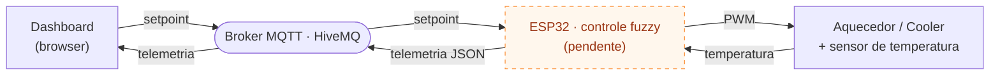

<div align="center">

# Câmara Térmica — Controle Fuzzy

Controle de temperatura de uma câmara térmica por **lógica fuzzy (Mamdani)**,
com visualização em tempo real por um dashboard web via **MQTT**.


`C213 · Sistemas Embarcados · Inatel`

</div>

---

## Sumário

- [Arquitetura](#arquitetura)
- [Convenção de sinais](#convenção-de-sinais)
- [Estrutura de arquivos](#estrutura-de-arquivos)
- [Como rodar o controlador](#como-rodar-o-controlador)
- [Como abrir o dashboard](#como-abrir-o-dashboard)
- [Comunicação MQTT](#comunicação-mqtt)
- [Limitações conhecidas](#limitações-conhecidas)

---

## Arquitetura



O sistema tem três peças conceituais:

| Peça | Arquivo | Papel |
|------|---------|-------|
| Projeto do controlador | `fuzzy.py` | Define pertinências + 25 regras, valida e gera gráficos (roda no PC, **offline**) |
| Interface | `dashboard.html` | Mostra temperatura/setpoint/erro/ação em tempo real e envia o setpoint |
| Controle embarcado | *(pendente)* | Firmware do ESP32 que lê o sensor, roda o fuzzy, aciona PWM e publica MQTT |

> O `fuzzy.py` é uma ferramenta **offline**: projeta o controlador, imprime testes de
> sinal e gera os gráficos das pertinências e da superfície de controle.

---

## Convenção de sinais

Toda a lógica segue uma convenção única, consistente entre o `.py` e o dashboard:

| Grandeza | Definição | Interpretação |
|----------|-----------|---------------|
| **erro** | `e = SP − T` | `e > 0` → está **frio** (T abaixo do setpoint) |
| **Δe** (delta_erro) | variação do erro entre amostras | tendência (esfriando / esquentando) |
| **u** (ação) | saída de controle em % | **`u > 0` → aquecer** · **`u < 0` → resfriar** |

Termos linguísticos: `NG` (negativo grande) … `ZE` (zero) … `PG` (positivo grande)
para as entradas; `RF` (resfriar forte) … `MA` (manter) … `AF` (aquecer forte) para a saída.

---

## Estrutura de arquivos

```
fuzzy_codigo/
├── fuzzy.py            # controlador fuzzy + geração de gráficos (offline)
├── dashboard.html      # painel web em tempo real (MQTT + Chart.js)
├── requirements.txt    # dependências Python
├── pertinencias.png    # gráfico das funções de pertinência (gerado pelo .py)
├── superficie.png      # superfície de controle 3D (gerado pelo .py)
└── README.md
```

---

## Como rodar o controlador

O controlador vive em `fuzzy.py`.

1. Crie um ambiente virtual e instale as dependências:

   ```bash
   python -m venv .venv
   # Windows
   .venv\Scripts\activate
   # Linux/macOS
   source .venv/bin/activate

   python -m pip install -r requirements.txt
   ```

2. Execute:

   ```bash
   python fuzzy.py
   ```

   O script imprime três testes de sinal e gera os dois gráficos:

   | Saída | O que mostra |
   |-------|--------------|
   | `pertinencias.png` | As funções de pertinência de **erro**, **Δe** e **ação** |
   | `superficie.png` | A **superfície de controle** 3D `u = f(erro, Δe)` |

---

## Como abrir o dashboard

O dashboard vive em `dashboard.html`.

> [!TIP]
> Sirva o arquivo por HTTP — alguns navegadores bloqueiam WebSocket a partir de `file://`.

```bash
python -m http.server 8080
# depois abra  http://localhost:8080/dashboard.html
```

O indicador de status mostra:

- 🔴 **Desconectado** — sem conexão com o broker (tenta reconectar a cada 3 s);
- 🟢 **Conectado** — recebendo telemetria normalmente;
- 🟡 **Conectado · sem dados** — conexão ativa, mas sem telemetria há mais de 8 s
  (ESP32 parou de publicar / sinal perdido).

Os botões de setpoint (35 / 50 / 65 °C) publicam o novo SP no broker.

### Painel "Inferência Fuzzy"

O dashboard reimplementa o controlador Mamdani em JavaScript (mesmas funções de
pertinência e as 25 regras de `fuzzy.py`) e mostra, em tempo real, o passo a
passo da inferência a cada amostra:

1. **Fuzzificação** — funções de pertinência de `erro` e `Δe` com o valor atual marcado
   e os termos ativos destacados;
2. **Base de regras** — a matriz 5×5; a célula destacada (com anel) é a regra dominante
   no instante, tingida pela intensidade de ativação μ;
3. **Defuzzificação** — o conjunto de saída agregado, o **centroide** e, em seguida, o
   **comando** após o ganho de saída `Ku` e a saturação em ±100 % (ver abaixo),
   atualizados junto com a telemetria.

### Saída do atuador (ganho Ku + saturação)

O centroide do conjunto agregado nunca alcança as bordas do universo — mesmo com `RF`/`AF`
totalmente ativados ele satura em ≈ ±79 %. Por isso o controlador aplica a estrutura padrão
**núcleo fuzzy → ganho de saída `Ku` ≈ 1,27 → saturação em ±100 %**, usando toda a faixa
física do atuador (`u>0` aquece, `u<0` resfria). O painel de defuzzificação mostra as duas
grandezas: o `centroide` (tracejado) e o `comando` final (linha cheia).

---

## Comunicação MQTT

| Item | Valor |
|------|-------|
| Broker | `broker.hivemq.com` |
| Porta | `8000` (WebSocket) |
| Tópico de telemetria | `inatel/c213/camara/dados` — **ESP32 → dashboard** (JSON) |
| Tópico de setpoint | `inatel/c213/camara/setpoint` — **dashboard → ESP32** (número como texto, `retained`) |

**Formato do JSON em `inatel/c213/camara/dados`:**

```json
{ "temp": 31.4, "sp": 50, "erro": 18.6, "u": 73 }
```

| Campo | Tipo | Descrição |
|-------|------|-----------|
| `temp` | número | temperatura medida (°C) |
| `sp`   | número | setpoint atual (°C) |
| `erro` | número | `e = sp − temp` (°C) |
| `u`    | número | ação de controle em % (`u>0` aquece, `u<0` resfria) |
| `de`   | número *(opcional)* | variação do erro Δe; se ausente, o dashboard a deriva de amostras sucessivas |

O dashboard tolera campos ausentes e ignora payloads com JSON inválido ou campos
mal-tipados (validação numérica em cada campo).

---

## Limitações conhecidas

- **Broker público sem isolamento:** `broker.hivemq.com` é compartilhado e sem
  autenticação/TLS; os tópicos são fixos. Para uso em laboratório, prefira WSS
  (porta 8884) e prefixe os tópicos com um identificador único da equipe.

---

<div align="center">
<sub>C213 · Sistemas Embarcados · Inatel</sub>
</div>
